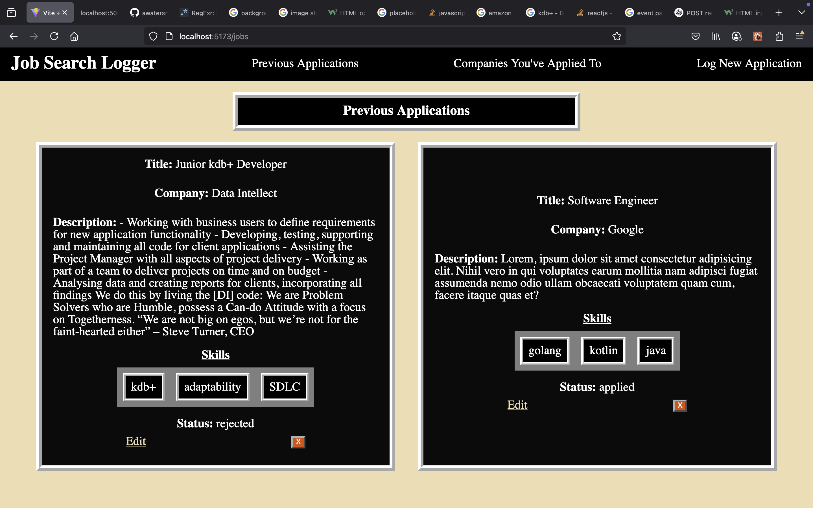
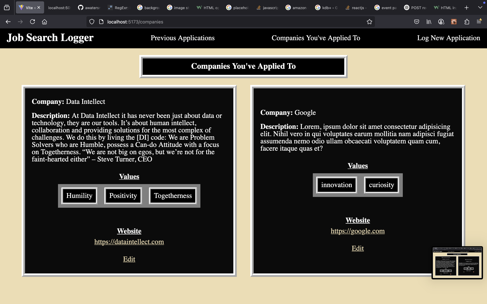
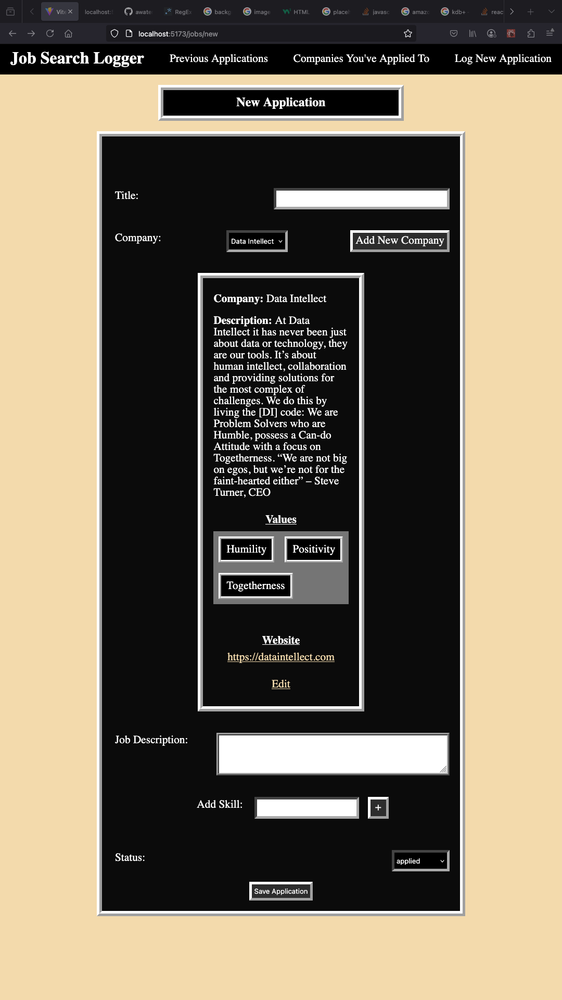
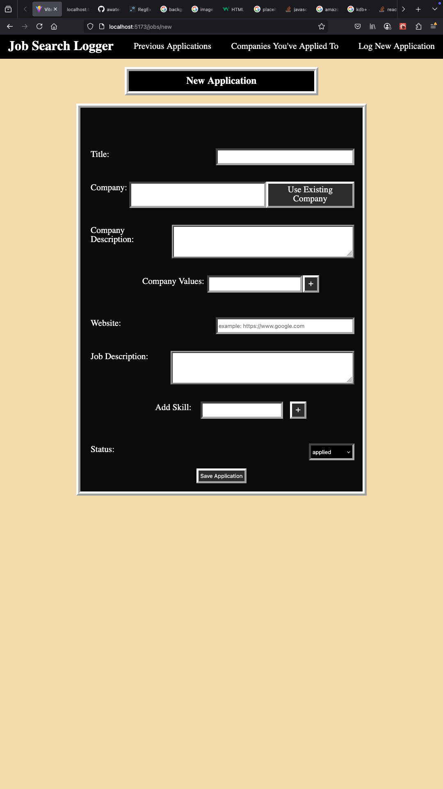
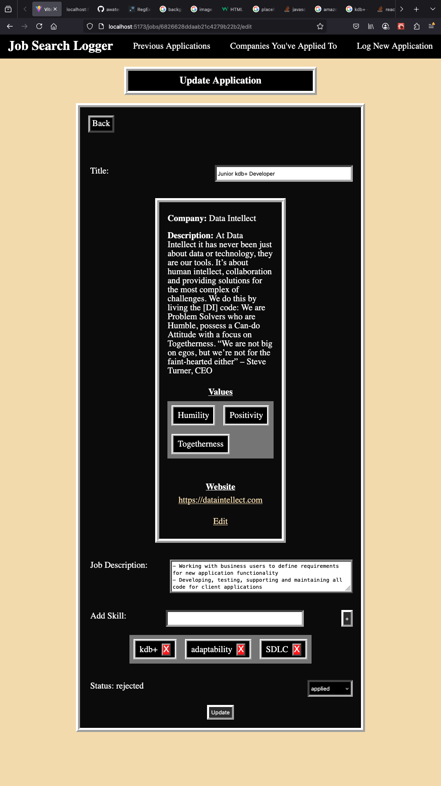

# Job Search Logger
### A react application that allows the user to keep track of their job applications
---

You can find the a API repository [here](https://github.com/awatersny/jobSearchLoggerAPI)

---

___

### Technologies Used

- Typescript
- Javascript
- React.js
- Vite
- Express.js
- Mongoose
- MongoDB

---

### Screenshots

---

---

---

---

---

## Icebox features (to-do)
- User authentication
- Save cover letter drafts